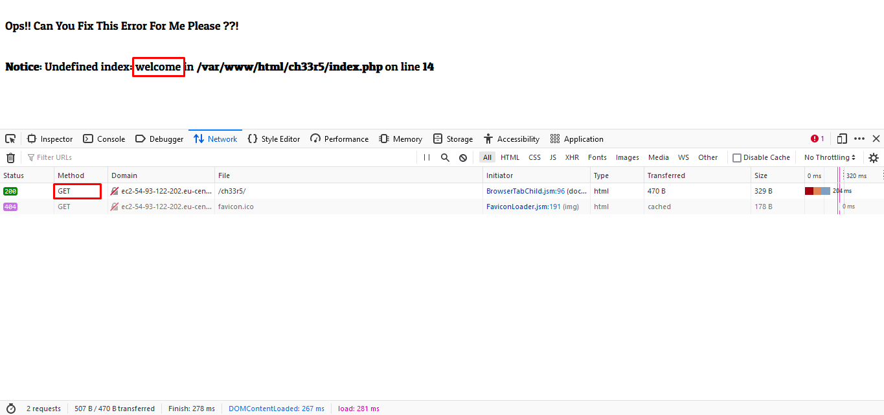
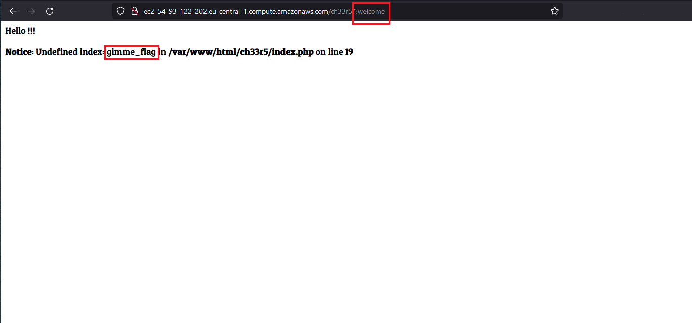
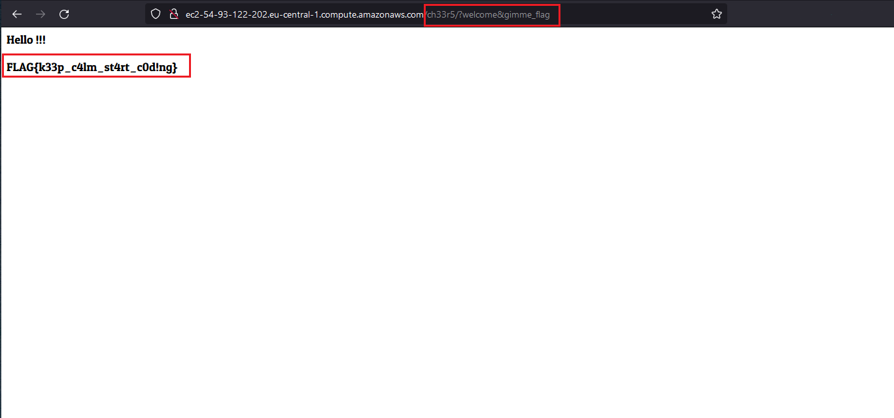

# [Cheers](https://cybertalents.com/challenges/web/cheers) Writeup

---

## Prerequisites

* PHP basics

---

## learn

* use errors messages in your pentesting
* GET request parameters

---

## Tools

* Nothing !!

---

## Solution

### Recon

1. after we open the challenge we got that page

    
    we got an error undefined index called **welcome**

2. from dev. tools we discovered that app working with GET requests

   

### Exploitation

1. so we will send **welcome** parameter in the URL

    >ch33r5/?welcome

    
    error message changed !!

    and it's look like require a new parameter called **gimme_flag**

2. as previous step we will add another parameter to   the URL

   >ch33r5/?welcome&gimme_flag

   

    and finally we got the flag

    >FLAG{k33p_c4lm_st4rt_c0d!ng}
