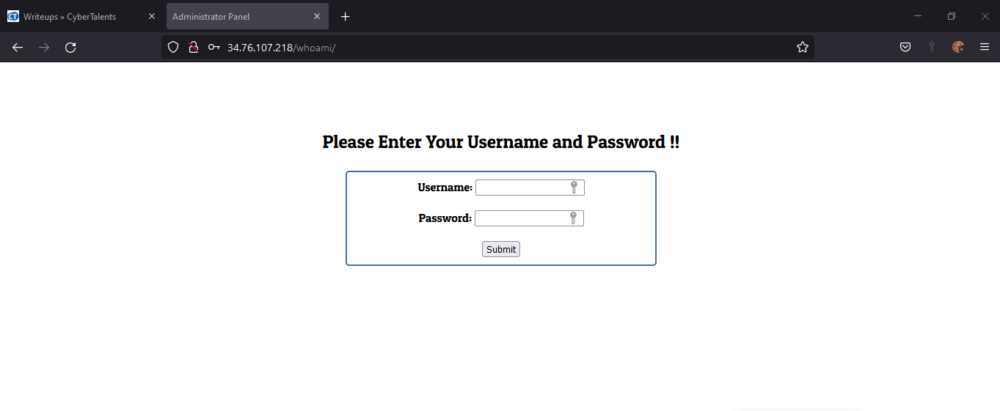
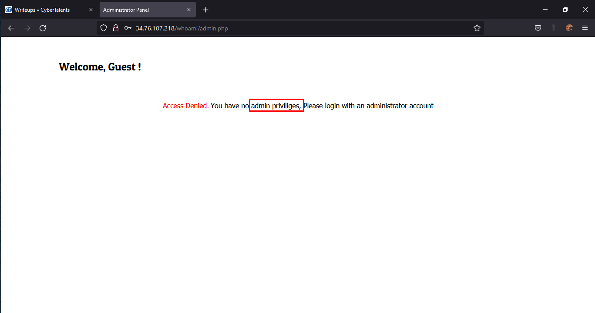
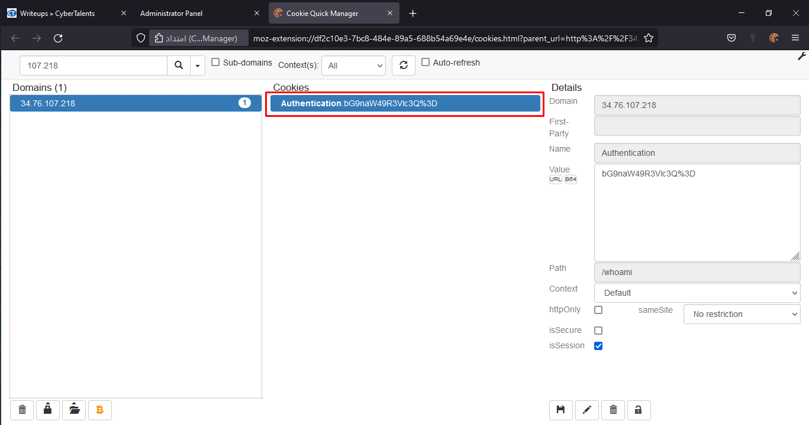
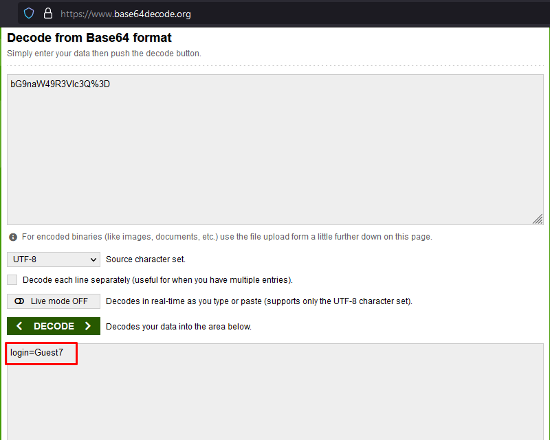
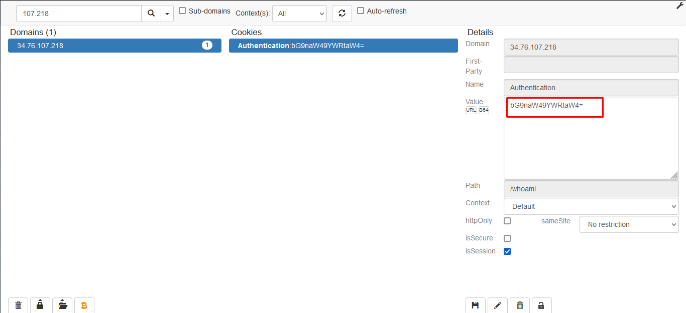
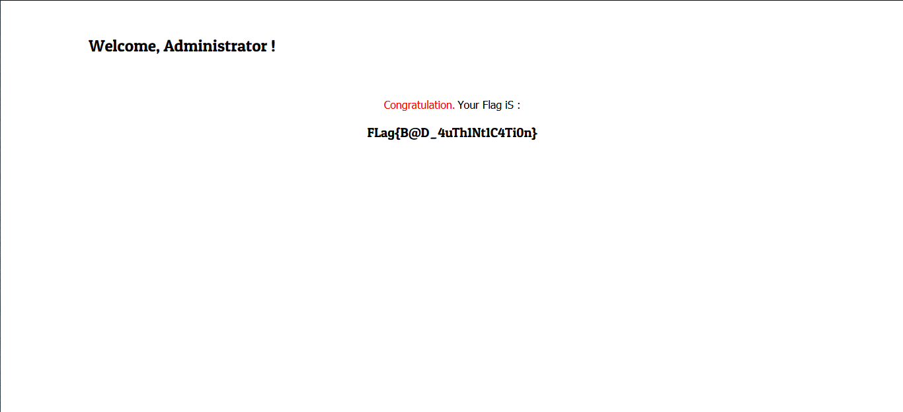

# [Who am i](https://cybertalents.com/challenges/web/who-am-i) Writeup

---

## Prerequisites

* Cookies
* Sessions
* Encoding

---

## learn

* editing cookies

---

## Tools

* Browser with any [cookie manger](https://addons.mozilla.org/en-US/firefox/addon/cookie-quick-manager/?utm_source=addons.mozilla.org&utm_medium=referral&utm_content=search)
* Burpsuite (optional)

---

## Solution

### Recon

1. after we open the challenge we got that page

    
    it's normal login page so we tried default credentials

    >username:admin &
    >password:admin

    and we got nothing

2. so we open page source to see if there are any thing interesting, and we got that credentials

    ```text
   Guest Account:
   -=-=-=-=-=-=-=-
   Username:Guest
   Password:Guest
    ```

### Exploitation

1. sign in using Guest credentials

    
    so we need a method to sign in as admin

2. check the cookies

   we can use burpsuite or just a cookie manger
   
   and we got a single cookie called **"Authentication"** with unreadable value
   >bG9naW49R3Vlc3Q%3D

   look like it was encoded with some type of encoders

3. Decoding

    by trying the most famous encoding **Base 64** with this [site](https://www.base64encode.org/) we got
    
    login=Guest7

    we change it to **admin** and encode it again

4. Encoding

    after we replace **"Guest7"** by **"admin"**

    we got that value
    >bG9naW49YWRtaW4=

5. Change the cookie

    by replace the old value with admin value in cookie manger and reload the page again
    
    

    and finally we got the flag

    >FLag{B@D_4uTh1Nt1C4Ti0n}
